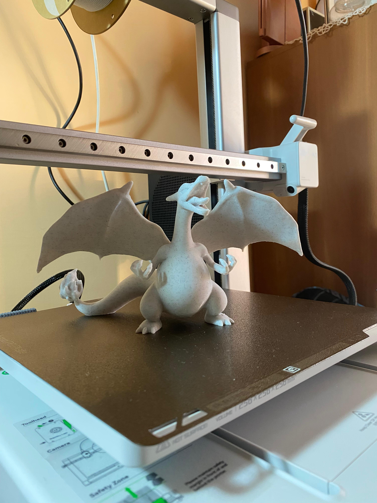
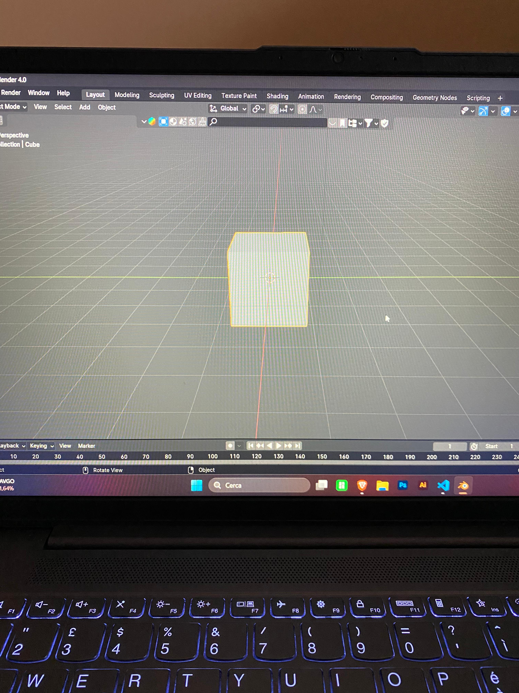
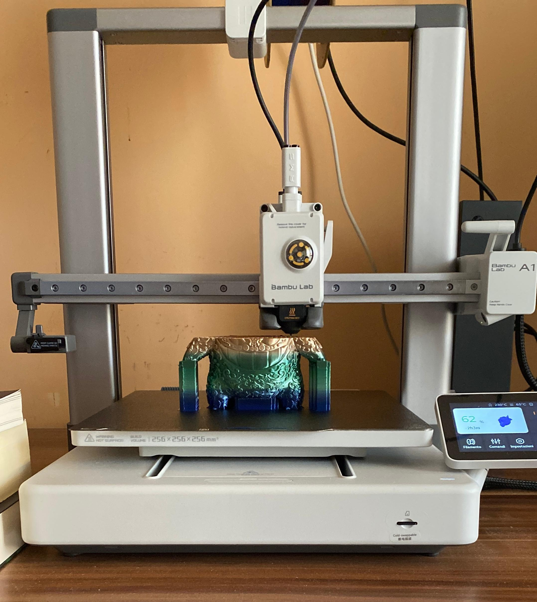

---
tags:
  - Blender
  - la stampante 3D
---

## la mia infanzia
sono cresciuto guardando i film della disney.
Grazie a questi film ho scoperto la mia passione ovvero il DISEGNO,
un' altra passione passione è il 3D. Mi sono avvicinanto a questo mondo
da quasi un anno a mezzo, e adesso mi piace stampare la cose 3D o crearle 
su Blender.

## Blender
Blender è un software libero e multipiattaforma di modellazione, rigging, animazione, montaggio video, composizione, rendering e texturing di immagini tridimensionali e bidimensionali. Dispone inoltre di funzionalità per mappature UV, simulazioni di fluidi, di rivestimenti, di particelle, altre simulazioni non lineari e creazione di applicazioni/giochi 3D.

Blender è dotato di un robusto insieme di funzionalità paragonabili, per caratteristiche e complessità, ad altri noti programmi per la modellazione 3D come Softimage XSI, Cinema 4D, 3D Studio Max, LightWave 3D e Maya.

## La stampante 3D
La mia stampante 3D è una BambuLab A1. il nome che gli ho dato è "Pina".La stampa 3D è un processo di produzione che consente la creazione di oggetti tridimensionali a partire da un modello digitale. È una soluzione per lavori di tipo additivo, che portano alla realizzazione del componente con la crescita dello stesso, strato per strato.[1]

La stampa 3D è utilizzata in una vasta gamma di settori tra cui:

manifatturiero, medicina, aerospaziale, architettura, moda, prototipazione rapida e arte. Le sue applicazioni sono in costante espansione, e le tecnologie e i materiali associati stanno crescendo, consentendo la creazione di oggetti sempre più complessi e personalizzati.

