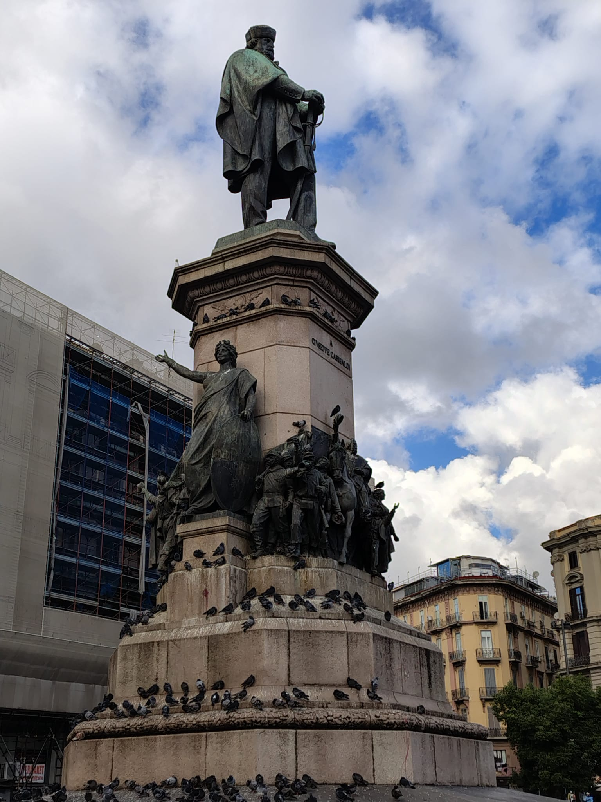
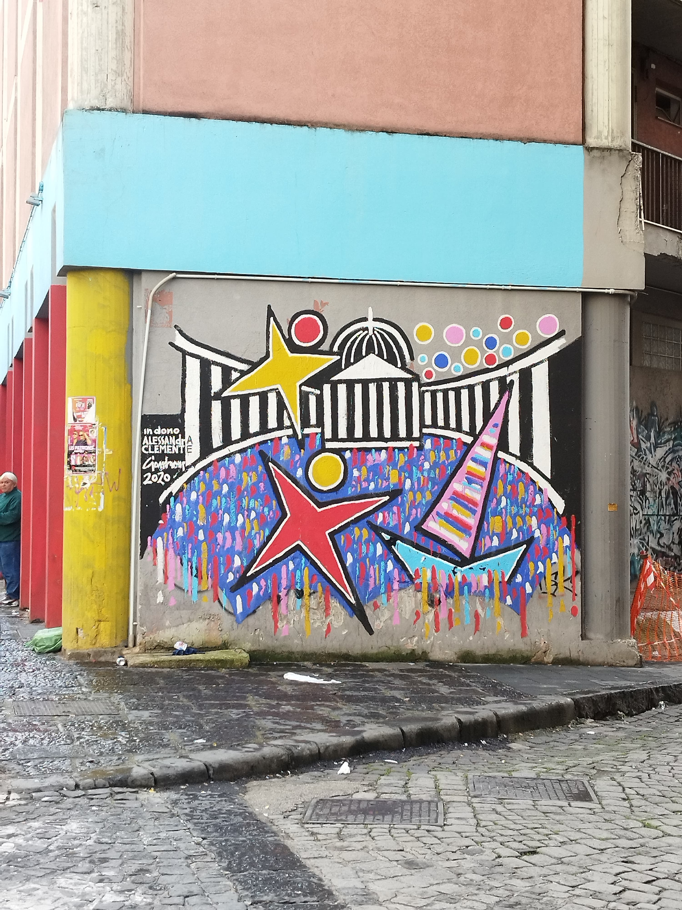
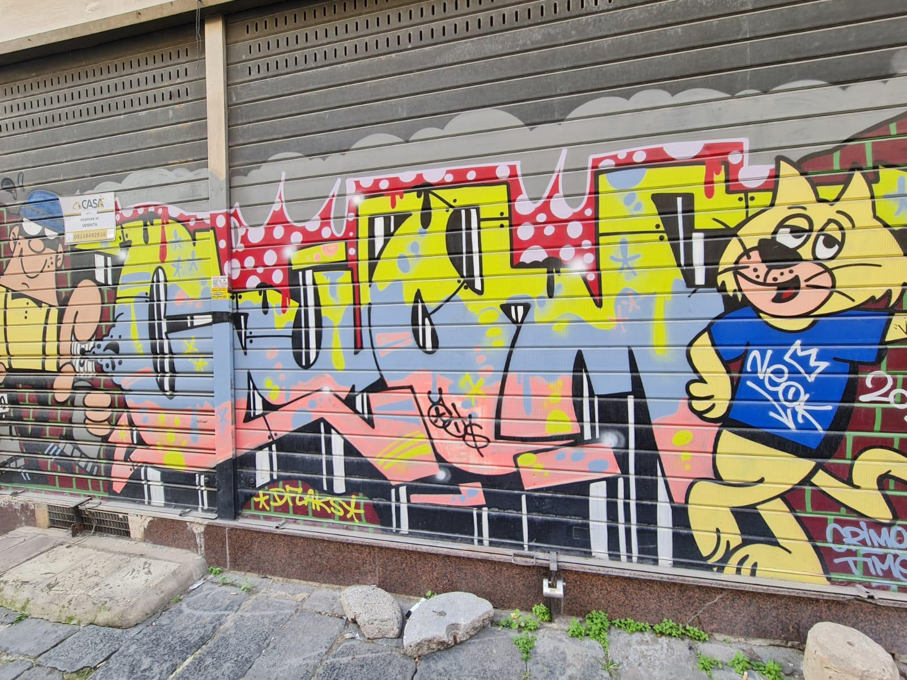
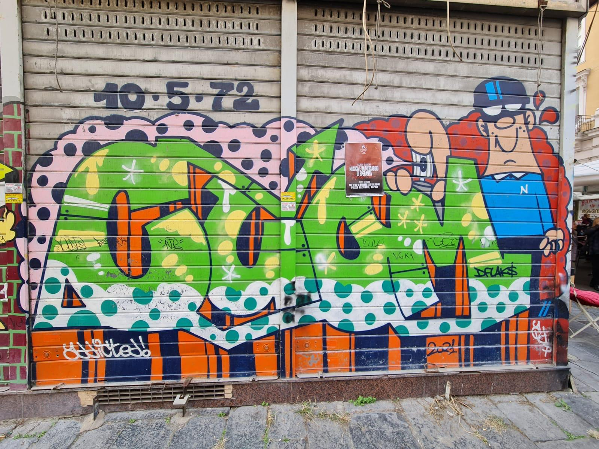

## LA PIAZZA
La prima impressione che ho avuto di piazza Garibaldi non era molto chiara, nonostante ci passi ogni giorno per andare in accademia. Un giorno, però, con il mio gruppo, abbiamo deciso di guardarla con occhi nuovi, senza pregiudizi, come farebbe un turista in visita in una città sconosciuta. Osservandola con maggiore attenzione, mi sono reso conto, insieme al mio gruppo, che la piazza si sviluppa a strati, quasi come una cipolla.
Abbiamo individuato otto strati principali, tutti interconnessi tra loro, ognuno dei quali rappresenta un volto diverso della piazza: architettura, graffiti e street art, multiculturalismo, interazione tra commercianti e territorio, zone verdi, comunicazione pubblicitaria, groviglio urbano e suoni.
Quello che trovo più affascinante è proprio questa interconnessione tra gli strati, ma soprattutto il fatto che ogni elemento racconta una storia che spesso passa inosservata. È una storia che merita di essere studiata e approfondita, perché svela dettagli che a prima vista non si colgono.

{ width="300" }

## IL MIO GRUPPO
Il mio gruppo è nato durante un sopralluogo nella piazza, quando abbiamo notato la grande quantità di graffiti e sticker presenti ovunque. Questa osservazione ci ha fatto riflettere molto e mi ha spinto a iniziare una ricerca, poi arricchita dal contributo del gruppo, sulle origini della street art e del graffitismo.
Ecco cosa ho scoperto: il graffitismo nasce alla fine degli anni ’60, quasi contemporaneamente in diverse città degli Stati Uniti. Si sviluppa in modo spontaneo, come una necessità impellente di ribellione contro le forme artistiche dell’epoca, ormai legate all’industria e alla produzione in serie. I graffitisti cercavano di recuperare quell’immediatezza e spontaneità che il design e la Pop Art avevano iniziato a escludere dai loro obiettivi.
All’inizio, era un fenomeno legato esclusivamente ai giovani afroamericani di New York, ma in seguito divenne uno strumento di espressione per i gruppi punk e per i loro ideali anarchici. Le scritte, più o meno curate, conosciute come tags, cominciarono a comparire sui muri della città, realizzate prevalentemente con bombolette spray. Stazioni, tunnel e metropolitane divennero i luoghi preferiti per queste opere.
Dal 1973, il graffitismo si evolve in un vero e proprio movimento artistico con la nascita del primo collettivo di artisti: gli United Graffiti Artists.
Durante i nostri sopralluoghi abbiamo notato molti tag, ma anche graffiti che esprimono ribellione politica. Alcuni contengono scritte ripetute o parole in lingue diverse. Analizzandole più attentamente, abbiamo scoperto che alcune di queste parole erano in arabo. Traducendole, abbiamo trovato messaggi che reclamano libertà e affrontano altri temi profondi.
Di recente, abbiamo realizzato un breve video in cui mostriamo un graffito e analizziamo il suo contesto complessivo. Il nostro studio è ancora in corso, ma passo dopo passo stiamo approfondendo ogni aspetto di questo straordinario fenomeno.

{ width="300" }
{ width="300" }
{ width="300" }
